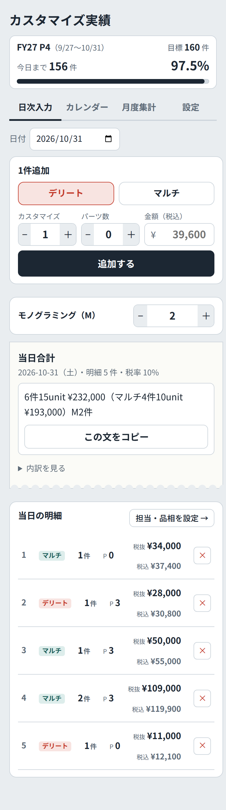
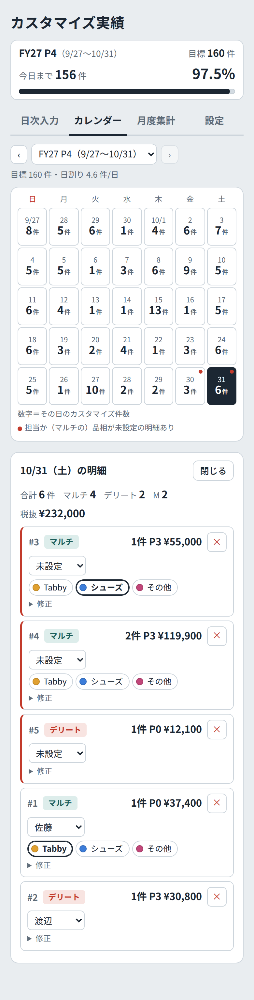
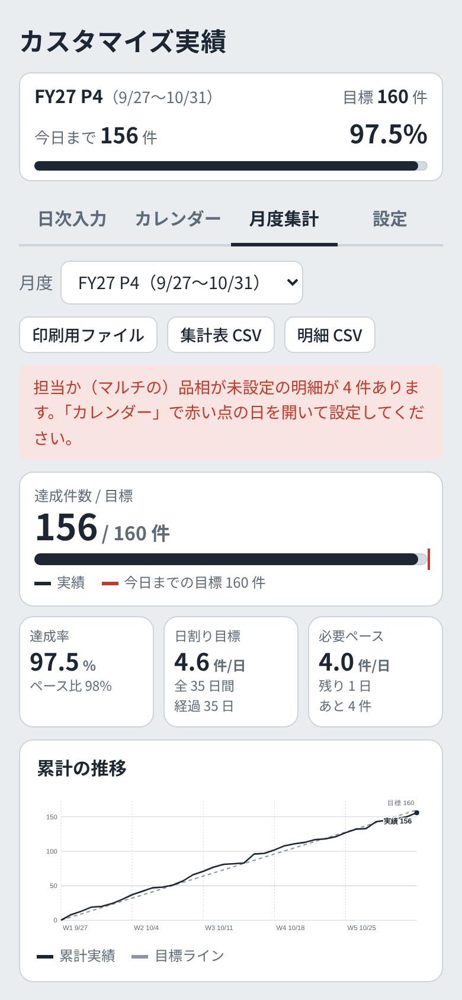
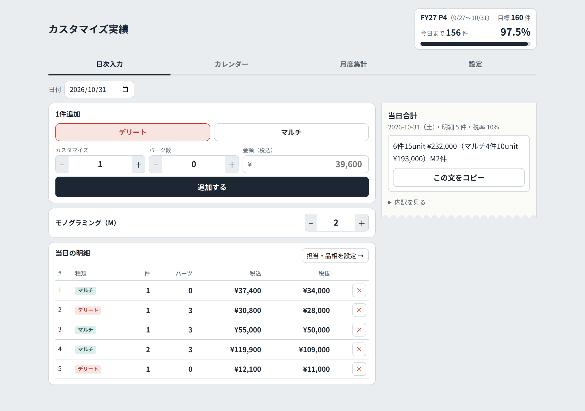
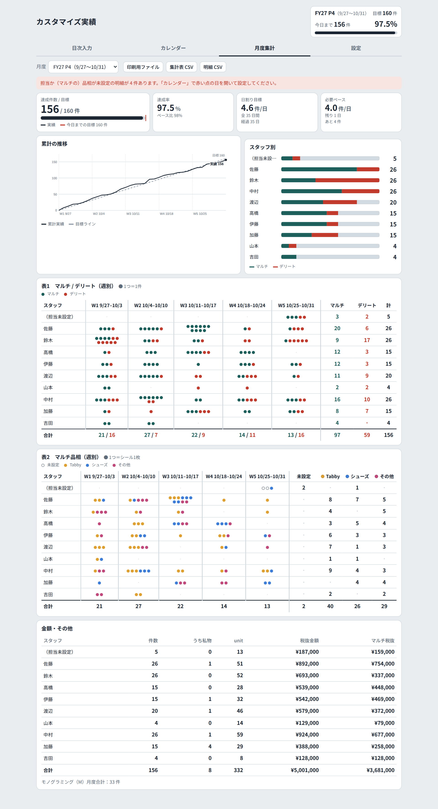
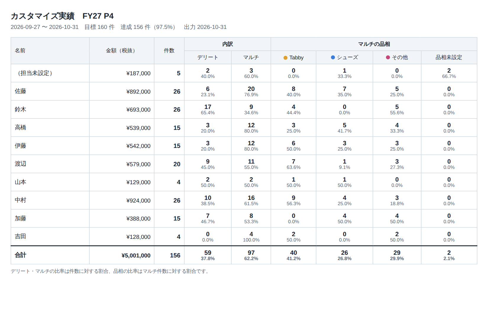
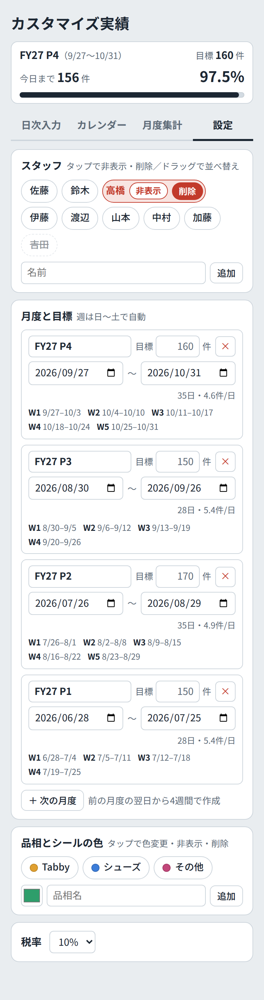

# Customization Sales Tracker (カスタマイズ実績)

[繁體中文](README.md) | **English** | [日本語](README.ja.md)

A **daily calculator + monthly reporting** system for in-store product customization. After entering the day's sales, staff copy the daily summary in one tap and paste it into LINE. At the end of each month, the system automatically produces each person's count, the Delete/Multi split, and the product-category breakdown, shown as dots that mimic the stickers the store used to put on paper sheets. It replaces manual arithmetic, hand-drawn tables, and sticker charts.

<p>
  
  
  
</p>

> All staff names and sales figures in the screenshots are fictional sample data. The UI is in Japanese, as it is used in a store in Japan.

---

## Background: the problem

The store offers two kinds of customization: **Multi (full price)** and **Delete (discounted)**. Multi items are further divided into categories such as Tabby bags, shoes, and others. The original workflow was:

- Every evening, **calculate by hand** the day's item count, unit count, and pre-tax amount, then post them to LINE in a fixed format.
- At month's end, **draw two tables by hand**: each person's weekly Multi/Delete counts, and each person's weekly Multi categories.
- Each person **puts a colored sticker** on the sheet for every item they complete, with the color representing the category.

This caused several problems:

1. **Slow and error-prone.** Converting tax-included prices to pre-tax amounts and adding up units every day invites mistakes.
2. **Stickers get forgotten.** A missed sticker causes errors at month-end, and it is hard to trace back afterwards.
3. **No visibility of progress.** The team only learned how far it was from the monthly target (e.g. 160 items) at the end of the month, too late to adjust.
4. **The tables had to be rebuilt every month.** The company uses its own fiscal calendar (e.g. FY27 starts on June 28; period P4 runs from 9/27 to 10/31), so each period has a different number of days and weeks.

## How the system is organized

The system has three parts, **designed around how work is actually divided in the store**:

| Part | Who uses it | What it does |
|---|---|---|
| **Daily input** | The person closing out each evening | Quickly enters each sale of the day, totals it automatically, and copies the summary for LINE in one tap |
| **Calendar** | Every staff member | Opens a day and assigns their own items to themselves, with a category |
| **Monthly summary** | Manager / everyone | Shows progress against the target, per-person results, weekly tables, and exports reports |

A **Settings** page manages the staff list, fiscal periods and targets, and the categories with their sticker colors.

This split is the core of the design: **entering data and attributing it are separate steps**. The person closing out only has to get the numbers right; they do not need to know who made each item. Each staff member fills in the owner and category later. This keeps the daily input screen as simple as the original calculator, no matter how many features are added elsewhere.

---

## Features

### Progress card

The top of every page shows the **current period, its dates, the target, the number completed so far, and the completion rate**, with a progress bar, so the current status is visible at a glance.

### Daily input



- Choose Delete or Multi, enter the item count, the parts count, and the **tax-included price**. The system **converts it to the pre-tax amount** automatically (10% or 8%).
- The day's total is formatted exactly as the LINE report requires and can be **copied in one tap**:
  ```
  6件15unit ¥232,000（マルチ4件10unit ¥193,000）M2件
  ```
- Monogramming (M) is recorded separately as a daily count.
- The list of the day's entries allows a final check before sending the report, and a mistaken deletion can be undone.

### Calendar

- A calendar for the selected period, where **each cell shows only the date and that day's count**. It stays uncluttered, and an entire period fits on one phone screen.
- If a day has entries **with no owner, or Multi entries with no category, a red dot appears** in the corner of that day.
- Tapping a day opens its entries for editing:
  - Assign the owner and choose the category (each button uses the sticker color)
  - Unassigned entries are **automatically listed first**, so they can be dealt with right away
  - Less common actions sit under "修正" (Edit): switching the type, marking an item as a staff member's own, correcting the count or price, and **splitting a multi-item entry into single items** (for when one entry covers items made by different people or in different categories)

### Monthly summary



- **Three progress indicators**:
  - **Completion rate**: items completed ÷ target
  - **Target to date**: how many items should be done by today at an even pace (the red line on the progress bar), showing at once whether the team is ahead or behind
  - **Required pace**: how many items per day are needed over the remaining days to reach the target
- **Cumulative chart**: the solid line is actual progress and the dashed line is the target line; the gap between them is how far ahead or behind the team is.
- **Per staff**: each person's Multi and Delete counts as a stacked bar.
- **Table 1 (Multi/Delete) and Table 2 (Multi categories)**: recreate the store's two paper tables, broken down by week (Sunday to Saturday). **Each dot is one item, just like one sticker**, in the sticker's color, which shows accumulation far more clearly than numbers.
- Items with no owner are listed in their own "unassigned" row so nothing is left out, and a notice appears at the top of the page.

### Export



| Button | Contents |
|---|---|
| **Printable report** | An A4 landscape monthly report: each person's amount, item count, Delete/Multi counts and shares, and each category's count and share |
| **Summary CSV** | The same content as a CSV file that opens directly in Excel |
| **Detail CSV** | Every individual entry, for reconciliation or backup |

On screen the data is shown as dots; **exports switch to plain numbers** that are easy to work with. The CSV files use an encoding that Excel reads correctly, so the Japanese text does not appear garbled.

### Settings



- **Staff**: shown as tags that can be **reordered by dragging**. Tapping a name shows "Hide" and "Delete".
- **Periods and targets**: set each period's name, dates, and target. **Weeks are split automatically from Sunday to Saturday**, so both 4-week and 5-week periods are handled correctly, and "+ Next period" creates the following period right after the last one.
- **Categories and sticker colors**: add, recolor, reorder, and delete freely.

---

## Design highlights

- **Nothing is lost when things change.** When someone leaves, "Hide" removes them from the menus while **past records and reports keep their name**. Categories work the same way: even a deleted category does not make old data disappear or display incorrectly; affected items simply become "unassigned" and can be reassigned.
- **Three safeguards against missing information**: red dots, unassigned entries listed first, and a notice on the monthly page. Together they make sure every item is attributed, replacing the risk of a forgotten sticker.
- **Protection against mistakes**: deletions can be undone, and actions with wide impact, such as deleting a period, require a second tap to confirm.
- **Mobile first**: every page was tuned for use on a phone. Each entry fits on one line, the tabs never need horizontal scrolling, the calendar fits on one screen, and the input area needs no scrolling back and forth.
- **Real-time collaboration**: data lives in a shared database, so when one person enters something, everyone else's screen updates immediately. People without edit rights automatically get a read-only view.
- **Dark mode** that follows the phone's system setting.
- **Keyboard support**: staff and categories can also be reordered with the arrow keys on a computer.

## Technical notes

- A **single HTML file** written in plain HTML, CSS, and JavaScript, with no framework or build step.
- The cumulative chart, dot tables, and progress bars are **all drawn by hand** with SVG and CSS, without a charting library.
- Colors are managed with CSS variables, supporting both light and dark themes.
- Data is stored in the **shared database provided by Claude Artifacts**, and file downloads use its download feature.

| File | Description |
|---|---|
| `customize-system.html` | The full system (daily input, calendar, monthly summary, settings). It must run on Claude Artifacts to use the shared database. |
| `daily-calculator.html` | A standalone version with only the daily calculator. Data stays in each person's browser, so it **can be hosted anywhere with no account required**. It is currently in use in the store. |

## My role and how it was built

I built this system in collaboration with an AI (Claude). My part was:

1. **Finding the problem**: identifying the pain points in the daily routine of manual arithmetic, table-making, and stickers.
2. **Defining the rules**: turning the store's customization rules (Multi/Delete, categories, fiscal periods and weeks, the LINE report format, tax-included vs. pre-tax prices) into clear written requirements for the AI to implement.
3. **Iterating on the details**: using it on a phone and requesting changes one by one, such as text size and proportions, which information should stay on screen and which should be tucked away, and how much fits on one line, to keep every screen simple.
4. **Anticipating problems**: asking the AI to list what could go wrong in real use, then deciding which issues to address. For example, "Will old records disappear when someone leaves?" led to the Hide feature, and "What if one entry includes items made by two people?" led to the Split feature.

## Limitations and next steps

**Current status**: the daily calculator (`daily-calculator.html`) is in use in the store. The full system, including the monthly summary, uses a database tied to a personal Claude account, so each colleague would need their own account and an invitation. For that reason it has not yet been tested store-wide, though it works in my own testing.

**Possible improvements**:

- **Move the database to a service the store or company owns** (such as Google Sheets), so the full system can be hosted anywhere and colleagues do not need extra accounts.
- **Record monogramming counts per person**; currently only the store's daily total is recorded.
- **Keep an edit history**, so that if a number is disputed it is possible to see who changed which entry and when.
- **Support returns and cancellations**; currently the only option is to delete the entry.
- **Bulk assign staff**: when one person made all of a day's items, assign every unassigned entry to them at once instead of one by one.
